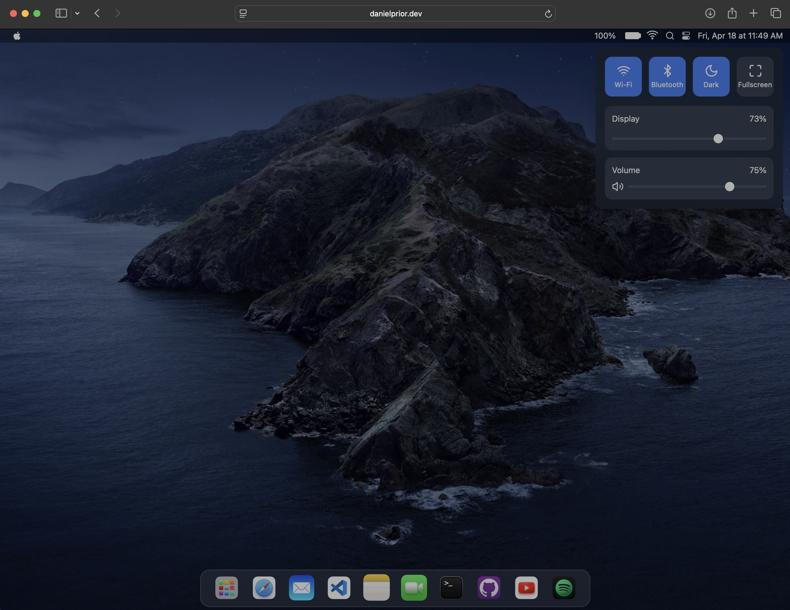

# 🍎 Divya Jyoty — macOS Interactive Portfolio

An immersive, interactive macOS Sonoma-inspired Web OS portfolio website built with **Next.js 15**, **React 19**, **TypeScript**, and **Tailwind CSS**.

[](https://opensource.org/licenses/MIT)
[](https://nextjs.org/)
[](https://react.dev/)
[](https://www.typescriptlang.org/)
[](https://tailwindcss.com/)



---

## 👨‍💻 About Divya Jyoty

**AI Engineer & Full-Stack Developer**  
🎓 **B.Tech in Computer Science and Engineering** @ **VIT-AP University** (2022–2026) · **CGPA: 9.39**  
🏆 **2x Hackathon Winner at IIT Hyderabad**  
☁️ **AWS Certified Cloud Practitioner** & **AWS Certified AI Practitioner**  
💼 Former **AI Software Engineer Intern** @ **IBM – Adroit Technologies** (Generative AI with Google Gemini & Flask)  

- **GitHub**: [github.com/jyotydivya](https://github.com/jyotydivya)
- **LinkedIn**: [linkedin.com/in/divya-jyoty](https://linkedin.com/in/divya-jyoty)
- **Email**: [jyotydivya844@gmail.com](mailto:jyotydivya844@gmail.com)

---

## ✨ Features & Interactive Applications

### 🌐 Safari with AI Project Intelligence (Apple Intelligence Style)
- **Smart Natural Language Search Bar**: Ask any technical question about Divya's engineering repositories directly from Safari's address bar.
- **Deep Project RAG Engine**: Instant, zero-config local intelligence with step-by-step reasoning, verified source repository cards, and key performance metric highlights.
- **Optional Gemini API Integration**: Built-in settings modal allowing users to plug in a custom Google Gemini API Key for live foundation model generation.
- **Interactive Follow-ups**: Dynamic suggested question pills to explore architecture, algorithms, and benchmark statistics.

### 💻 Visual Studio Code & Multi-Agent Simulator
- Dedicated workspace showcasing the **[Collective-Intelligence](https://github.com/jyotydivya/Collective-Intelligence)** multi-agent simulation research.
- **High-Contrast Code Editor**: JetBrains Mono / Fira Code monospace font stack with tokenized Python syntax highlighting supporting both dark and light modes.
- **Run Simulator Engine**: Click the **Run Simulator** button to trigger a 1,000-round stochastic dynamic simulation and view the final Matplotlib visual plots:
  - **Figure 1**: Collective Intelligence Performance Comparison (`performance.png`)
  - **Figure 2**: Dynamic Trust Evolution Over Time (`trust.png`)
  - Quantitative research metrics (Decision Entropy: `0.684`, Trust Volatility: `0.012`, Minority Correctness: `14.3%`).
  - Lightbox modal with zoom and image download capabilities.

### 📄 Preview (Resume PDF App)
- Native macOS Preview-style document viewer rendering `Divya_Jyoty_Resume.pdf`.
- Features instant PDF download, responsive zoom controls, print preview, and desktop shortcut.

### 🐙 GitHub Repository Explorer
- Full showcase of Divya's **10 open-source repositories** with live search, tags, and category filtering (**AI/ML**, **Full-Stack**, **Systems**):
  1. `GPU-Accelerated-ML-Inference-Benchmark` (CUDA C++, TensorRT, PyTorch, cuDNN — 35% speedup)
  2. `Collective-Intelligence` (Stochastic Multi-Agent Simulation & Trust Dynamics)
  3. `Selective-Intelligence` (Reinforcement Learning with 1,152 states, Tabular Q-Learning vs DQN)
  4. `Skill-Swap-Hub` (React, Node, Express, MongoDB, Socket.IO WebSockets, Razorpay HMAC-SHA256)
  5. `Campus-EMS` (Campus Event Management System, QR ticket verification, MERN stack)
  6. `D-ASK` (TypeScript & Next.js AI Assistant and Semantic Knowledge Retrieval)
  7. `Movie-Recommendation-System` (Cosine Similarity & CountVectorizer on TMDB dataset)
  8. `Employee-Turnover-Prediction` (XGBoost, Random Forest & SHAP Explainable AI)
  9. `Weather-Forecast-App` (JavaScript & OpenWeatherMap REST API)
  10. `Portfolio` (macOS Interactive Web OS)
- High-contrast day and night mode styling matching native GitHub design tokens.

### ⌨️ Terminal (zsh)
- Authentic command-line interface with shell prompt `divya@macbook-pro ~ $`.
- Interactive custom commands:
  - `projects` — Lists all repositories with descriptions and tech stacks
  - `skills` — Categorized breakdown of AI/ML, Full-Stack, and Cloud tools
  - `experience` — Professional internship work at IBM–Adroit Technologies
  - `education` — VIT-AP University details and CGPA
  - `awards` — IIT Hyderabad hackathon wins and IETE leadership
  - `resume` — Launches the Resume viewer
  - `contact` — Quick links to Email, LinkedIn, and GitHub
  - `clear`, `help`, `history`, `date`, `whoami`

### 📝 Notes App
- Structured Apple Notes interface documenting:
  - About Divya Jyoty & Bio
  - Technical Skills & Cloud Certifications
  - Work Experience & Leadership
  - Featured Projects & Research

### 🎛️ macOS System Chrome
- **Dynamic Dock**: Fluid parabolic magnification effect on hover with running app indicators.
- **Spotlight Search**: Press <kbd>⌘ Command</kbd> + <kbd>Space</kbd> or click the search icon in the menubar to quickly search and launch apps.
- **Control Center**: Working Dark/Light mode toggle, screen brightness slider, and Wi-Fi state toggle.
- **Window Management**: Draggable, resizable windows with minimize, maximize, and smooth focus ordering.
- **Lock & Login Screen**: Instant biometric-style login button and <kbd>Enter</kbd> key support.

---

## 🛠️ Tech Stack

| Domain | Technologies |
| :--- | :--- |
| **Framework & Core** | Next.js 15.2.4 (App Router), React 19, TypeScript |
| **Styling & Design** | Tailwind CSS 3.4, Tailwind Animate, Glassmorphism, CSS Variables |
| **UI Components** | Radix UI Primitives, Lucide React Icons |
| **AI & Search Engine** | Custom In-Memory RAG Engine, Optional Google Gemini 1.5 Flash API |
| **Data & Visualizations** | Recharts, Matplotlib Generated Figures, WebSockets (Socket.IO concepts) |

---

## 🚀 Getting Started

### Prerequisites
- **Node.js**: `18.x` or `20.x` or higher
- **Package Manager**: `npm` (configured with `legacy-peer-deps=true`)

### Installation

1. **Clone the repository**:
   ```bash
   git clone https://github.com/jyotydivya/Portfolio.git
   cd Portfolio
   ```

2. **Install dependencies**:
   ```bash
   npm install
   ```

3. **Run the development server**:
   ```bash
   npm run dev
   ```

4. **Open in browser**:
   Navigate to [http://localhost:3000](http://localhost:3000) to view your macOS portfolio!

### Production Build

To test and compile an optimized production build:
```bash
npm run build
npm run start
```

---

## 📁 Repository Structure

```
├── app/
│   ├── api/
│   │   └── safari-ai/         # Server-side Safari AI API endpoint
│   ├── globals.css            # Global Tailwind tokens & styling
│   ├── layout.tsx             # Root layout with metadata & hydration guards
│   └── page.tsx               # Main portfolio entrypoint
├── components/
│   ├── apps/
│   │   ├── facetime.tsx       # FaceTime app
│   │   ├── github.tsx         # GitHub 10-project browser with day/night contrast
│   │   ├── mail.tsx           # Contact & messaging app
│   │   ├── notes.tsx          # Apple Notes bio & skills
│   │   ├── resume.tsx         # macOS Preview PDF viewer
│   │   ├── safari.tsx         # Safari browser with AI project search
│   │   ├── snake.tsx          # Classic Snake game
│   │   ├── spotify.tsx        # Music player demo
│   │   ├── terminal.tsx       # Interactive zsh shell emulator
│   │   ├── vscode.tsx         # VS Code Collective-Intelligence simulator
│   │   ├── weather.tsx        # Weather forecast app
│   │   └── youtube.tsx        # Video player app
│   ├── control-center.tsx     # Control center with brightness & dark mode
│   ├── desktop.tsx            # Desktop icons, window layer, and wallpaper
│   ├── dock.tsx               # Dynamic magnifying macOS dock
│   ├── launchpad.tsx          # Application grid launchpad
│   ├── login-screen.tsx       # Clean login screen with instant key
│   ├── menubar.tsx            # Top system status bar
│   ├── spotlight.tsx          # Global spotlight search
│   └── window.tsx             # Draggable & resizable window wrapper
├── lib/
│   ├── project-ai.ts          # Structured knowledge base & semantic RAG engine
│   └── utils.ts               # Classname merger utility
├── public/
│   ├── Divya_Jyoty_Resume.pdf # Downloadable resume PDF
│   ├── performance.png        # Simulation bar plot
│   ├── trust.png              # Simulation trust evolution plot
│   └── ...                    # Icons & wallpapers
└── package.json
```

---

## 🤝 Contributing

Contributions, feedback, and suggestions are welcome! Feel free to open an issue or submit a pull request on [GitHub](https://github.com/jyotydivya/Portfolio).

---

## 📝 License

This project is open-source and licensed under the [MIT License](LICENSE).

---

<p align="center">
  <sub>Engineered with ❤️ by <strong>Divya Jyoty</strong></sub>
</p>
